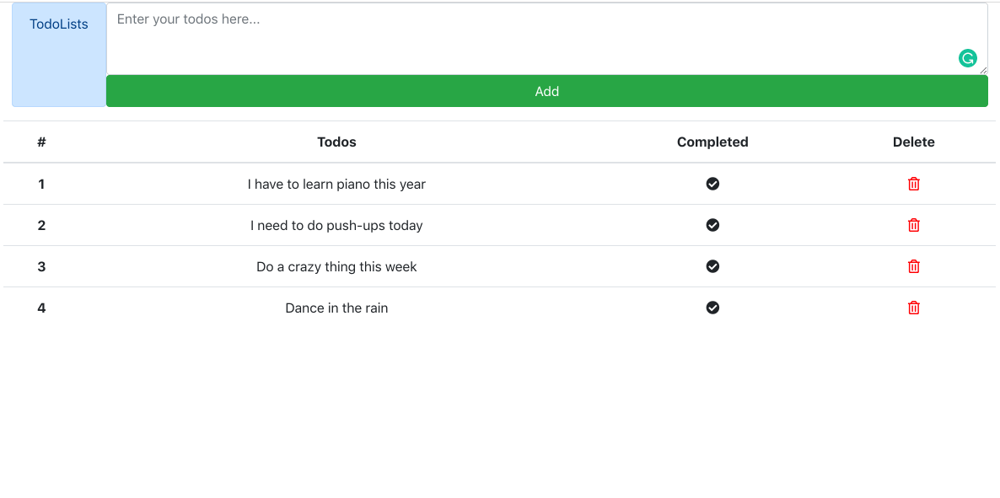

# Todolists

The front-end is made with React, the backend is made with Django and Postgresql
. Css package is Bootstrap and font-awesome, additional packages are django rest framework, axios.

## Features

* View all todos
* Add a new todo
* Delete a todo
* Mark a todo as complete

**Simple Prototype of Todolists**

